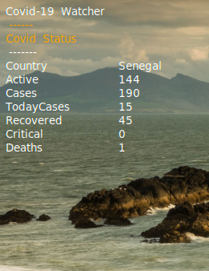
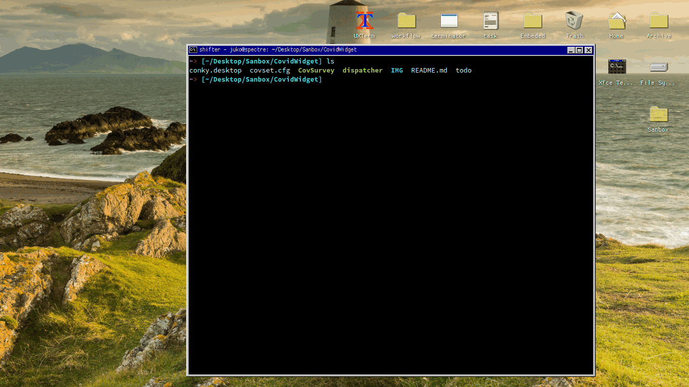
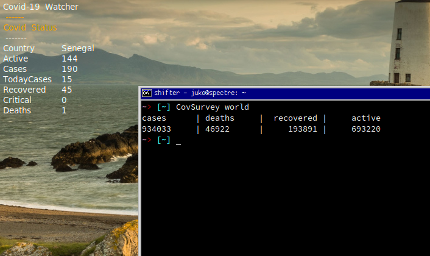
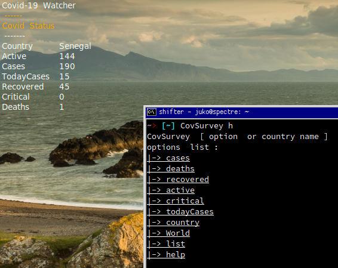
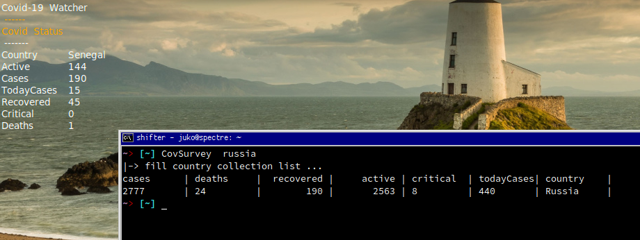

```
   __|         _)     |\ \      /_)     |            |   
  (     _ \\ \ /|  _` | \ \ \  /  |  _` |  _` |  -_)  _| 
 \___|\___/ \_/_|\__,_|  \_/\_/  _|\__,_|\__, |\___|\__| IXI 
                                        ____/          
``` 
_powered  by [ COVID-19 ]_


 
 

CovidWidget i is a small Widget writen in python3 to follow real time information about COVID-19 on your desktop.  
and no need to look for information elsewhere, information will come to you. 

Fast , simple and minimalistic  programme , it only gives you the essential information you need to know and also comes with a command  cli that allows you to have more information if you wish ... 

Its Installation is simple and fast no need to configure just to clone and you launch the dispatcher and it's done!
it relies on your IP to determine your location (unless you are using a vpn or proxy :D )

it's based on **conky 1.10.x** except that there are no other dependencies.
 
A simplist and standard design    
if you are a regular user on conky you can modify the .conkyrc file for a design that suits you.  



# INSTALLATION 
---
To install it is simple   

``` 
 $ git clone https://github.com/Jukoo/CovidWidget.git

 . /dispatcher   
```


that's it. 


# Extra 
---

the Command Line Version is available in your system as soon as you launch the installation to allow users to search for other information about the world or other countries.    


```
CovSurvey [ option or country ] 
``` 






by default if you don't specify anything it takes your default location and display the necessary   informations   

#  Uninstall 

 to uninstall you have to go to the directory where you cloned the repository and run 

```
 $ ./dispatcher clean
 
```

> to disable the Conky display on your desktop 

```
$ killall concky  
```


_love Pull Request_

**don't hesitate to report issues if you find a bug!!!**

``I'm open to all proposals to improve it.` 